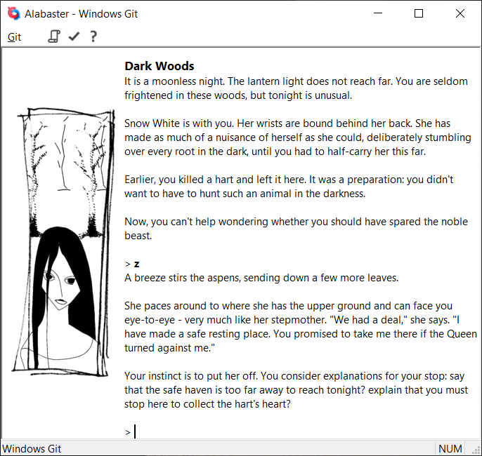

# Git

Git is an interpreter for the [Glulx](https://eblong.com/zarf/glulx/) virtual machine, which is widely used to play interactive fiction (text adventure) games created with [Inform 7](http://inform7.com/).

Git's main goal in life is to be fast. It's about five times faster than [Glulxe](https://github.com/erkyrath/glulxe), and about twice as fast as Frotz (using the same Inform source compiled for the Z-machine). It also tries to be reasonably careful with memory: it's possible to trade speed off against memory by changing the sizes of Git's internal buffers.

To be compiled into a useable program, Git needs to be built against a [Glk](https://eblong.com/zarf/glk/) library to provide it with a user interface. Included with Git are the source files needed to compile against [Windows Glk](https://github.com/DavidKinder/Windows-Glk), and the latest release on this GitHub project also includes a Windows executable build of Git with Windows Glk.



## Building on Windows

Download and install Visual Studio 2019 Community edition from https://visualstudio.microsoft.com/. In the installer, under "Individual Components", make sure that "C++ Clang Compiler for Windows" and "C++ Clang-cl" are selected.

To be able to build the CHM help file, download and install Microsoft's [HTML Help Workshop](https://web.archive.org/web/20200810052030/https://www.microsoft.com/en-us/download/confirmation.aspx?id=21138). Note that this is a link to the version on the Internet Archive as the link to this on Microsoft's site does not work at the moment.

Install git (that is, the distributed version control system). I use the version of git that is part of Cygwin, a Linux-like environment for Windows, but Git for Windows can be used from a Windows command prompt.

Open the environment that you are using git from (e.g. Cygwin), and switch to the root directory that the build environment will be created under (from here referred to as "\<root>"). Clone this repository with git:
```
git clone https://github.com/DavidKinder/Git.git Adv/Git
```

Download the latest release of the Windows Glk library from https://github.com/DavidKinder/Windows-Glk/releases/ and copy everything in the WindowsGlk-nnn.zip archive to "\<root>/Adv/Git/win/WindowsGlk".

### Compiling the project

Start Visual Studio, open the solution "\<root>/Adv/Git/win/Git.sln", then build and run the "Git" project.

